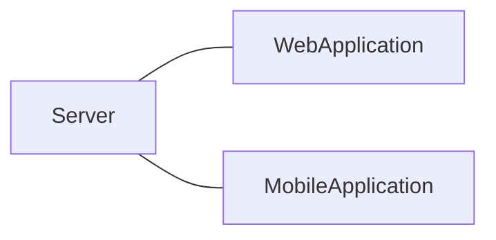
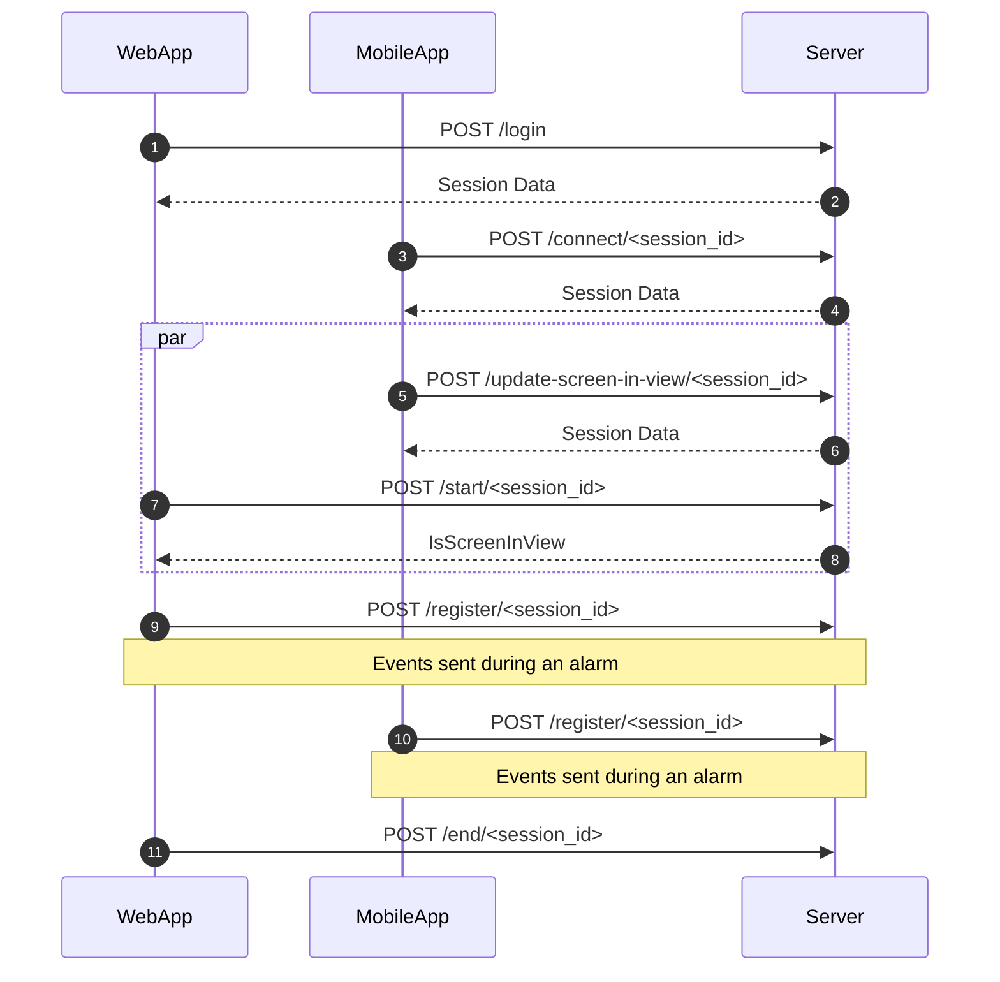

```mermaid
flowchart LR;
  Server---WebApplication
  Server---MobileApplication
```

```mermaid
sequenceDiagram
    autonumber
    participant WebApp
    participant MobileApp
    participant Server
    WebApp->>Server: POST /login
    Server-->>WebApp: Session Data
    MobileApp->>Server: POST /connect/<session_id>
    Server-->>MobileApp: Session Data

    par
    MobileApp->>Server: POST /update-screen-in-view/<session_id>
    Server-->>MobileApp: Session Data
    WebApp->>Server: POST /start/<session_id>
    Server-->>WebApp: IsScreenInView
    end

    WebApp->>Server: POST /register/<session_id>
    Note over WebApp,Server: Events sent during an alarm


    MobileApp->>Server: POST /register/<session_id>
    Note over MobileApp,Server: Events sent during an alarm


    WebApp->>Server: POST /end/<session_id>
   

    
```
